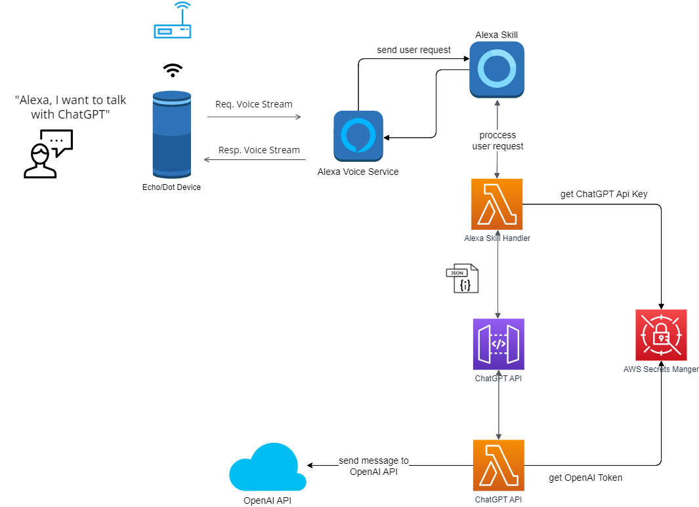
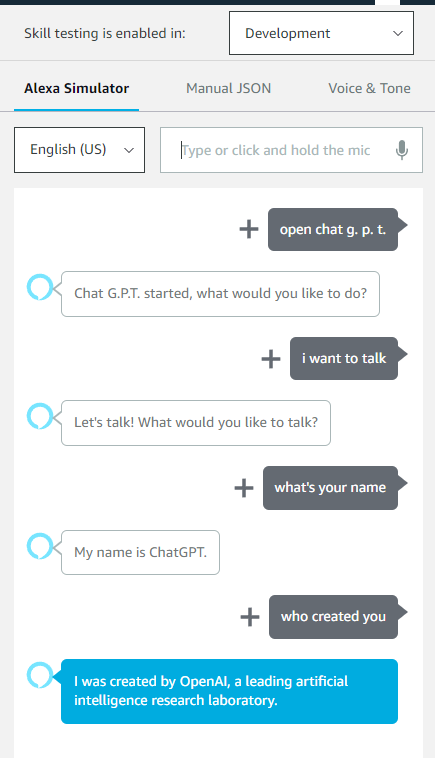
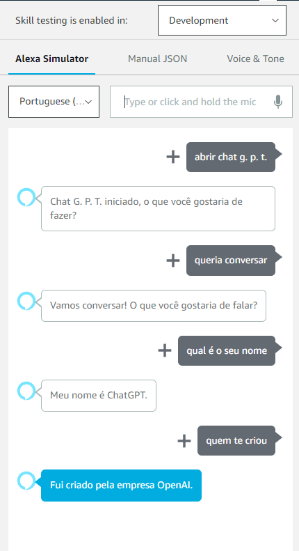

# Alexa GPT

Este projeto foi desenvolvido em NodeJS e utilizando serviços serveless da AWS como lambda functions, api gateway e etc...

A aplicação permite que você utilize a Alexa para interagir com a API do ChatGPT, um modelo de linguagem natural avançado que pode ser treinado para realizar uma variedade de tarefas de conversação. Com essa integração, é possível criar experiências de conversação personalizadas e interativas usando a sua voz, em qualquer dispositivo compatível com a Alexa.

Este repositório contém o código fonte da aplicação, bem como instruções detalhadas para a instalação e configuração do ambiente. Além disso, há também exemplos de uso e documentação completa da API disponível.

## Nota

> Atualmente o time da Alexa rejeito o aplicativo por não poussir filtro nas respostas enviada pelo ChatGPT, em breve lançarei um update aplicando alguns filtro para não responder sobre conteudo explicitos, adultos e etc. para ficar dentro das politicas da alexa

## Usage examples

en-US   | pt-BR
--------- | ------
 | 

