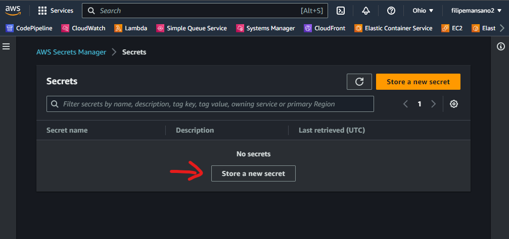
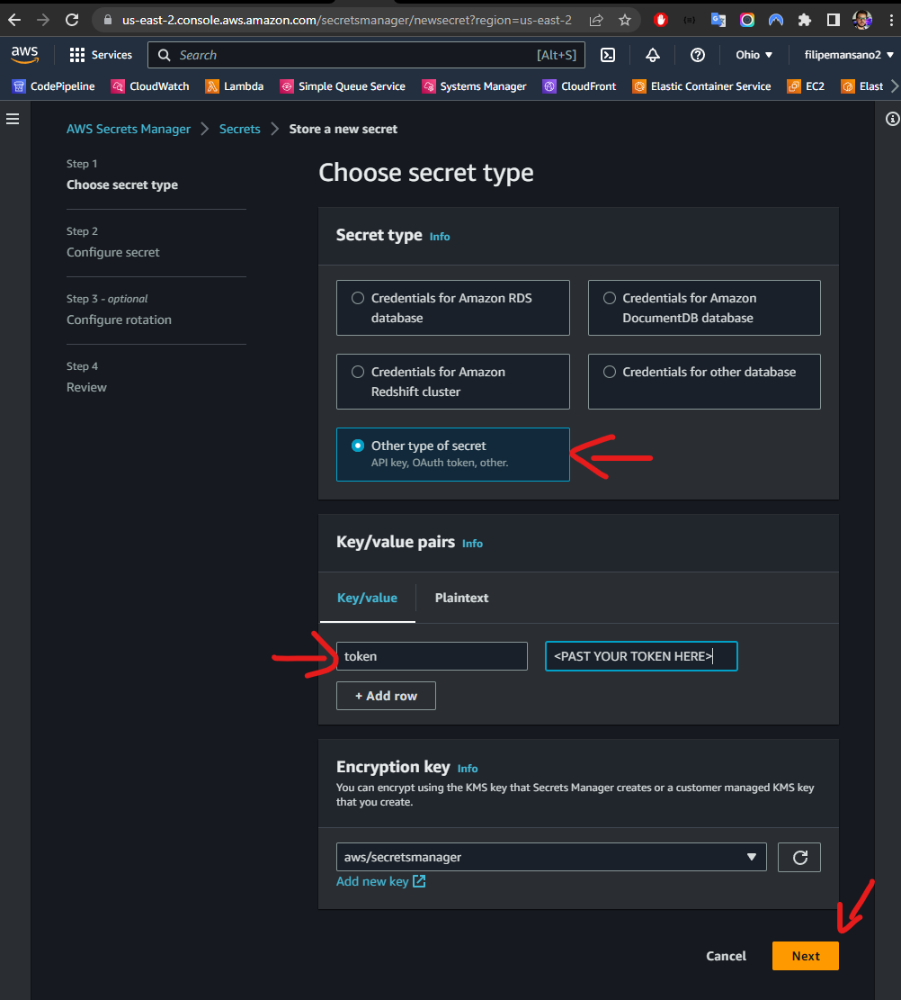
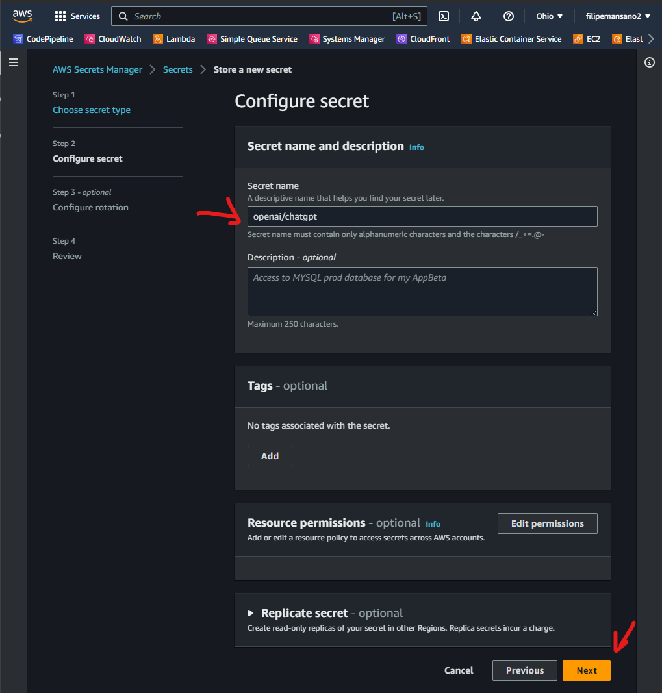
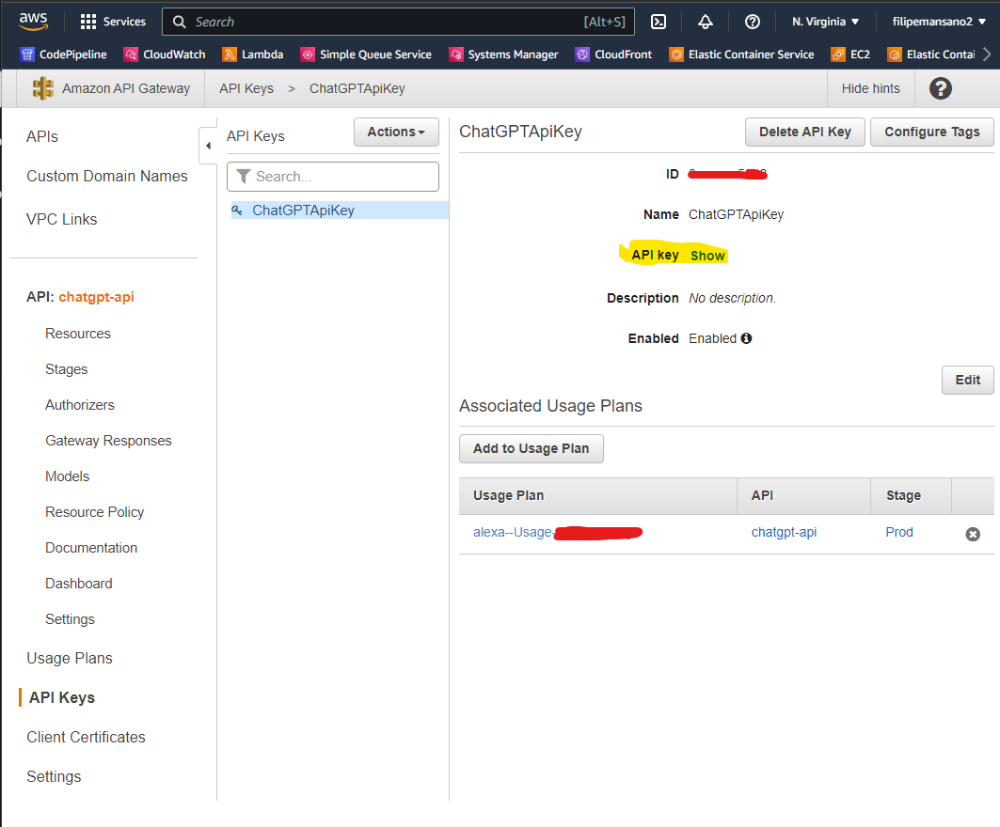

# Chat GPT API
Este projeto demonstra como criar uma aplicação que faz a comunicação com o modelo de linguagem Chat GPT usando a AWS Lambda e a API Gateway.

## Pré-requisitos
* AWS CLI (https://aws.amazon.com/cli/)
* SAM CLI (https://docs.aws.amazon.com/serverless-application-model/latest/developerguide/serverless-sam-cli-install.html)
* Node.js (https://nodejs.org/)
* Conta na AWS com as permissões necessárias para criar e gerenciar recursos.

## Instalação
Clone este repositório em seu computador local.

Navegue até a pasta raiz do projeto e instale as dependências usando o seguinte comando:

```bash
npm install
```

# Configuração

Crie uma chave de API na [OpenAI](https://platform.openai.com/account/api-keys)


Crie um recurso no AWS Secret Manger para armazenar a chave do OpenAI

_lembre-se de criar na mesma região onde iria ficar sua aplicação_





Após a 3 etapa, clique em "Next", "Next" e "Store"

# Implatação

```bash
npm run generate:layers # gere os arquivos necessários para o layer do lambda
npm run build # converte o codigo typescript em javascript
sam deploy --guided # o argumento --guided é necessário só na primeira vez
```

Siga as instruções para criar o recurso na AWS. Certifique-se de lembrar o nome do recurso, pois ele será necessário para chamar a API.

## Como usar

Acesse seu Rest API no console da AWS para acessar a chave de api gerada para realizar os requests



_atualize o secret criado anteriormente adicionando essa chave também com a key de **apiKey** ela será necessária da etapa da Alexa_

Para utilizar a API, faça uma requisição POST para a URL da API Gateway, passando o corpo da mensagem em JSON:

```json
POST https://<api-gateway-endpoint>/Prod

Header: {
    "Content-Type": "application/json",
    "x-api-key": "xxxxx"
}

Body:
{
  "message": "olá, como posso te ajudar?",
  "parentMessageId": "<opcional>"
}
```

O corpo da resposta terá o ID da mensagem e o texto da mensagem de resposta gerada pelo modelo GPT:

```json
{
  "id": "message-id",
  "text": "resposta do modelo GPT"
}
```

Arquitetura
A arquitetura da aplicação consiste em:

* **API Gateway**: fornece um ponto de entrada para a API.
* **AWS Lambda**: executa o código da aplicação e faz chamadas para a API do OpenAI.
* **OpenAI API**: modelo de linguagem Chat GPT que gera respostas com base nas entradas fornecidas.
* **AWS Secrets Manager**: armazena a chave de acesso para as credenciais da API do OpenAI.

Licença
Este projeto está licenciado sob a Licença MIT. Consulte o arquivo LICENSE para obter mais informações.